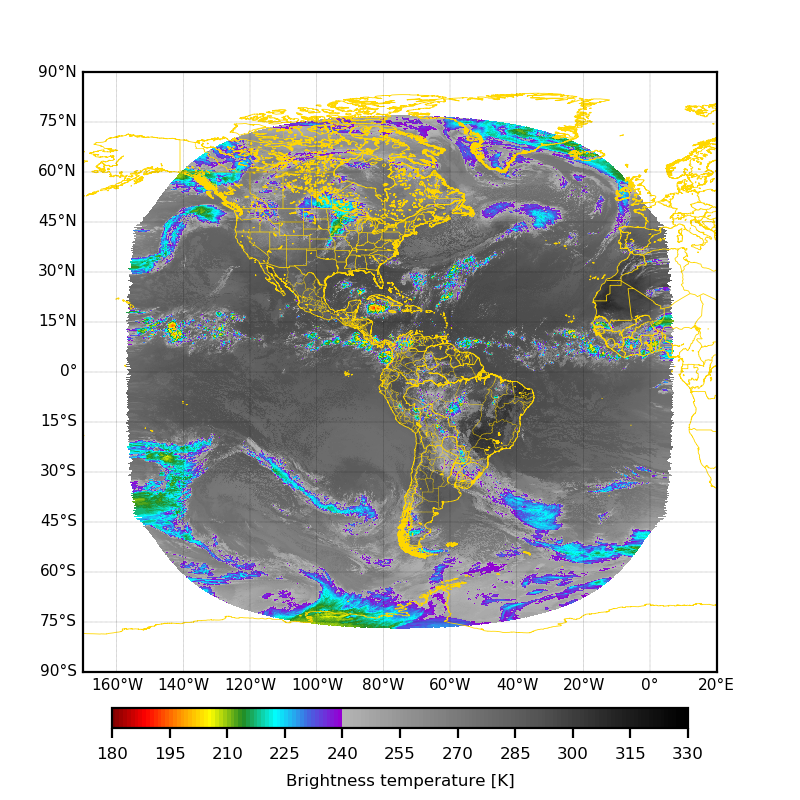
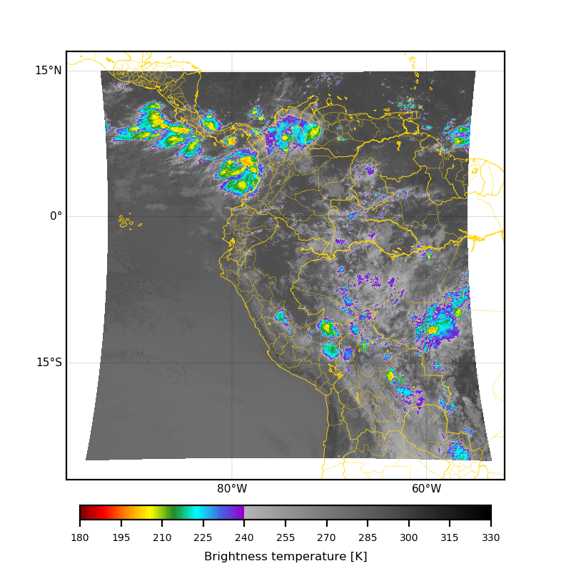

# This README is still being edited and may have some errors.

# GOES
Python packages to download and process data from GOES-16 and GOES-17.

# Requirements
- [Numpy](https://numpy.org/)
- [s3fs](https://s3fs.readthedocs.io/en/latest/install.html)


# Usage
## Download data of GOES-16 and GOES-17 from amazon

We will assume that you want to download the full disk image of channels 05, 08, 09, 10 and 13 of GOES-16 of August 2, 2019 from 1930 UTC until 2030 UTC. You can do it with the following code:

```
import GOES as GOES

GOES.download_from_amazon('G16', 'ABI-L2S', Domain = 'FD', Channel = ['05','08','09','10','11','13'], DateTimeIni = '20181001-170000', DateTimeFin = '20181001-171000', PathOut='/my/path/')
```

where:\
&nbsp;&nbsp;&nbsp;**'G16'** indicates the satellite name,\
&nbsp;&nbsp;&nbsp;**'ABI-L2S'** indicates the instrument and product,\
&nbsp;&nbsp;&nbsp;**Domain = 'FD'** indicate the domain of the data,\
&nbsp;&nbsp;&nbsp;**Channel = ['05','08','09','10','11','13']** is the list of channels that will be download,\
&nbsp;&nbsp;&nbsp;**DateTimeIni = '20181001-170000'** indicates the initial date time of the download,\
&nbsp;&nbsp;&nbsp;**DateTimeFin = '20181001-171000'** indicates the initial date time of the download,\
&nbsp;&nbsp;&nbsp;and **PathOut='/my/path/'** indicate the folder where the data will be saved.
\
\
Depending the instrument and the product selected, the third and four parameter may be optional. For example, in the case of **'GLM'**, this parameters are ignored.\
\
To know what are the other options use show_download_options as seen in the following line:
```
import GOES as GOES

GOES.show_download_options()
```
\
or using the help option of download_from_amazon:
```
import GOES as GOES

help(GOES.download_from_amazon)
```
Note: Use the "q" key of keyboard to get out of help option.
\
\
Other form to speficates the channels is using hyphen ('-') between channels, look at the parameter Channel in following example:
```
import GOES as GOES

GOES.download_from_amazon('G16', 'ABI-L2S', Domain = 'FD', Channel = ['05','08-11','13'], DateTimeIni = '20181001-170000', DateTimeFin = '20181001-171000', PathOut='/my/path/')
```
\
\
If you just want to download data from one specific time you can do it ignoring DateTimeFin parameter.
```
import GOES as GOES

GOES.download_from_amazon('G16', 'ABI-L2S', Domain = 'FD', Channel = ['05','08-11','13'], DateTimeIni = '20181001-170000', PathOut='/my/path/')
```
\
\
In other hand, if you want to download data from GLM between 18 UTC and 20:30 UTC from August 2, 2019, do it as follows:
```
import GOES as GOES

GOES.download_from_amazon('G16', 'ABI-L2S', DateTimeIni = '20181001-180000', DateTimeFin = '20181001-203000', PathOut='/my/path/')
```
\
\
Because the files names have the scan start time, the scan end time and, scan file creation time, causing that the name is very long and complicated to call (especially for the seconds). One alternative to simplificate this is use the option **Rename=True**, which rename the download file, manteining just the the scan start time in the name of file. The default value of this parameter is **Rename=False**, so it is not necessary to write it if you do not want to rename the files. Using this parameter the previous code would look like this:
```
import GOES as GOES

GOES.download_from_amazon('G16', 'ABI-L2S', DateTimeIni = '20181001-180000', DateTimeFin = '20181001-203000', PathOut='/my/path/', Rename = True)
```
\
\
\
 
## Get coordinates of images pixels and select region of images.
One of the biggest problems we have when trying to visualize images from GOES-16 or GOES-17 is to extract the coordinates of each pixel in the image.\
A easy form to do it is through the function **get_lonlat**, pay attention to next code.\
First, import packages and open the file:
```
import numpy as np
from netCDF4 import Dataset
import GOES as GOES
dataset = Dataset('OR_ABI-L2-CMIPF-M6C13_G16_s20192781230281_e20192781240001_c20192781240078.nc')
```
Then, we get parameters from file and pass it to **get_lonlat**.
```
SatLon = dataset.variables['goes_imager_projection'].longitude_of_projection_origin
SatHeight = dataset.variables['goes_imager_projection'].perspective_point_height
SMajorAx = dataset.variables['goes_imager_projection'].semi_major_axis
SMinorAx = dataset.variables['goes_imager_projection'].semi_minor_axis

xrad = dataset.variables['x']
yrad = dataset.variables['y']
var = dataset.variables['CMI']
lons, lats = GOES.get_lonlat(xrad, yrad, SatLon, SatHeight, SMajorAx, SMinorAx)
```
The outputs of get_lonlat are two 2D-arrays with lon and lat of each satellite images pixel.\
If you would like visualizate the full disk images you need mask values of the channel, use the next code:
```
var = np.where((var[:].mask==True)|(lons==-999.99), np.nan, var[:])
```
If you want to use pcolormesh to visualizate the data, you will need calculate the corners of any pixel of satellite images. To do that let us use the function get_lonlat_corners:
```
loncor, latcor = GOES.get_lonlat_corners(lons, lats)
```
If you want to visualizate the data using Basemap and using the package [custom_colot_pallete](https://github.com/joaohenry23/custom_color_palette), add the next code:
```
import matplotlib.pyplot as plt
import matplotlib.colors as colors
import custom_color_palette as ccpl
from mpl_toolkits.basemap import Basemap

# Creates define plot area and its projection
LLLon, URLon = -170.0, 20.0
LLLat, URLat = -90.0, 90.0
bmap = Basemap(projection='cyl', llcrnrlon = LLLon, urcrnrlon = URLon,
         llcrnrlat = LLLat, urcrnrlat = URLat, resolution='i')
loncor, latcor = bmap(loncor, latcor)


# Creates custom color palette and colorbar labels
ListColor = ['maroon', 'red', 'darkorange', '#ffff00', 'forestgreen', 'cyan', 'royalblue', (148/255, 0/255, 211/255)]
mypalette, colorslabels = ccpl.creates_palette([ListColor, plt.cm.Greys],
                           [180.0,240.0,330.0], EditPalette=[None,[180.0,330.0,240.0,330.0]])
norm = colors.BoundaryNorm(colorslabels, ncolors=mypalette.N)
tickslabels = np.arange(180,331,15)


# Creates figure
fig = plt.figure('Example 01', figsize=(4,4), dpi=200)
ax = fig.add_axes([0.1, 0.16, 0.80, 0.75])

bmap.drawcoastlines(linewidth=0.3, linestyle='solid', color='gold')
bmap.drawcountries(linewidth=0.3, linestyle='solid', color='gold')
bmap.drawstates(linewidth=0.15, linestyle='solid', color='gold')
bmap.drawparallels(np.arange(-90.0, 91.0, 15.0), labels=[True, False, False, True], fontsize=5.5, linewidth=0.1, color='black')
bmap.drawmeridians(np.arange(0.0, 360.0, 20.0), labels=[True, False, False, True], fontsize=5.5, linewidth=0.1, color='black')

img = bmap.pcolormesh(loncor, latcor, var, cmap=mypalette, norm=norm)
cbar = plt.colorbar(img, ticks=tickslabels, extend='neither', spacing='proportional',
         orientation = 'horizontal', cax=fig.add_axes([0.14, 0.09, 0.72, 0.025]))
cbar.ax.tick_params(labelsize=6)
cbar.set_label(label='Brightness temperature [K]', size=6, color='black', weight='normal')

plt.show()
```



If you would like select a specific region, you can do it using **slice_sat_image**.
Fist import packages and open de satellite images.
```
import numpy as np
from netCDF4 import Dataset
import matplotlib.pyplot as plt
import matplotlib.colors as colors
import GOES as GOES
import custom_color_palette as ccpl
from mpl_toolkits.basemap import Basemap

dataset = Dataset('OR_ABI-L2-CMIPF-M6C13_G16_s20192781230281_e20192781240001_c20192781240078.nc')
```
Then, we get parameters from file and pass it to **slice_sat_image**.
```
SatLon = dataset.variables['goes_imager_projection'].longitude_of_projection_origin
SatHeight = dataset.variables['goes_imager_projection'].perspective_point_height
SMajorAx = dataset.variables['goes_imager_projection'].semi_major_axis
SMinorAx = dataset.variables['goes_imager_projection'].semi_minor_axis

xrad = dataset.variables['x']
yrad = dataset.variables['y']
var = dataset.variables['CMI']

var, lons, lats, limits = GOES.slice_sat_image(var, xrad, yrad,
                           SatLon, SatHeight, SMajorAx, SMinorAx, -95.0, -55.0, -25.0, 15.0, DeltaIndex=8)
```
Afterward, we calculate the corners of satellite image pixels.
```
loncor, latcor = GOES.get_lonlat_corners(lons, lats)
```
Finally, import the necessary packages and we visualizate the satellite image.
```
import matplotlib.pyplot as plt
import matplotlib.colors as colors
import custom_color_palette as ccpl
from mpl_toolkits.basemap import Basemap

# Creates define plot area and its projection
LLLon, URLon = -97.0, -52.0
LLLat, URLat = -27.0, 17.0
bmap = Basemap(projection='cyl', llcrnrlon = LLLon, urcrnrlon = URLon,
         llcrnrlat = LLLat, urcrnrlat = URLat, resolution='i')
loncor, latcor = bmap(loncor, latcor)


# Creates custom color palette and colorbar labels
ListColor = ['maroon', 'red', 'darkorange', '#ffff00', 'forestgreen', 'cyan', 'royalblue', (148/255, 0/255, 211/255)]
mypalette, colorslabels = ccpl.creates_palette([ListColor, plt.cm.Greys],
                           [180.0,240.0,330.0], EditPalette=[None,[180.0,330.0,240.0,330.0]])
norm = colors.BoundaryNorm(colorslabels, ncolors=mypalette.N)
tickslabels = np.arange(180,331,15)


# Creates figure
fig = plt.figure('Example 02', figsize=(4,4), dpi=200)
ax = fig.add_axes([0.1, 0.16, 0.80, 0.75])

bmap.drawcoastlines(linewidth=0.3, linestyle='solid', color='gold')
bmap.drawcountries(linewidth=0.3, linestyle='solid', color='gold')
bmap.drawstates(linewidth=0.15, linestyle='solid', color='gold')
bmap.drawparallels(np.arange(-90.0, 91.0, 15.0), labels=[True, False, False, True], fontsize=5.5, linewidth=0.1, color='black')
bmap.drawmeridians(np.arange(0.0, 360.0, 20.0), labels=[True, False, False, True], fontsize=5.5, linewidth=0.1, color='black')

img = bmap.pcolormesh(loncor, latcor, var, cmap=mypalette, norm=norm)
cbar = plt.colorbar(img, ticks=tickslabels, extend='neither', spacing='proportional',
         orientation = 'horizontal', cax=fig.add_axes([0.14, 0.09, 0.72, 0.025]))
cbar.ax.tick_params(labelsize=5)
cbar.set_label(label='Brightness temperature [K]', size=6, color='black', weight='normal')

plt.show()
```



# Installation
You can install GOES on Python 2 or 3 on Linux, Windows or other, using the following commands.
\
\
From PYPI using pip:
```
pip install GOES

```
\
\
From Github using clone.
```
clone https://github.com/joaohenry23/GOES.git
cd GOES
python setup.py install

```
\
Or also from github downloading **GOES-master.zip** and following the next commands.
```
unzip GOES-master.zip
cd GOES-master
python setup.py install

```

# Support
If you have any questions, do not hesitate to write to:
```
joaohenry23@gmail.com

```

